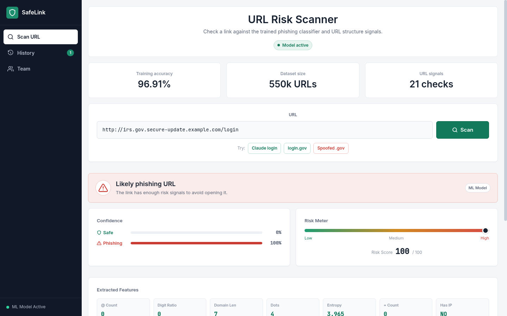
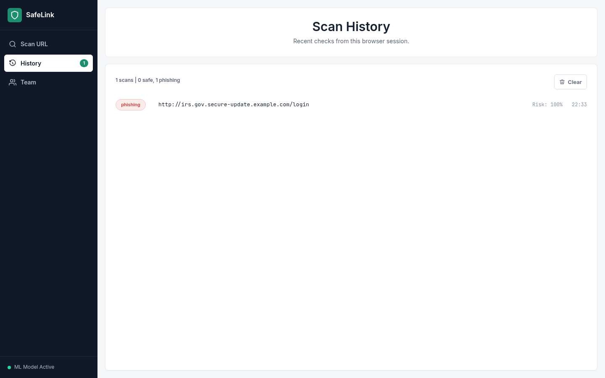

# Phishing URL Detection using Machine Learning

<p align="center">
  <strong>SafeLink scan dashboard</strong><br>
  
</p>
<p align="center">
  <strong>Scan history</strong><br>
  
</p>


The Internet has become an essential part of modern life, but it has also created opportunities for cybercriminals to conduct phishing attacks. Phishing websites are designed to deceive users and steal sensitive information such as usernames, passwords, and account credentials. As attackers continuously evolve their techniques, traditional detection methods often struggle to keep pace. Machine Learning offers an effective solution by identifying patterns and characteristics commonly associated with phishing URLs. This project implements a Machine Learning-based phishing URL detection system to accurately classify URLs as legitimate or malicious. The goal is to enhance web security and provide safer browsing experiences.

## Project Structure

```text
phishing_url_detection_using_ML-main
├── gui
│   ├── app.py
│   ├── static
│   │   ├── css
│   │   │   └── style.css
│   │   └── js
│   │       └── main.js
│   └── templates
│       └── index.html
├── images
│   ├── history_page.png
│   ├── home_page.png
│   └── url_structure.png
├── phishing_detection
│   ├── data_set
│   │   ├── extracted_features.csv
│   │   └── phishing_site_urls.csv
│   ├── extract_features_from_url.py
│   ├── features.txt
│   ├── __init__.py
│   ├── models
│   │   └── phishing_url_model.joblib
│   ├── predict_url.py
│   ├── __pycache__
│   │   ├── extract_features_from_url.cpython-313.pyc
│   │   └── __init__.cpython-313.pyc
│   ├── requirements.txt
│   └── train_model.py
├── README.md
└── tests
    ├── test_extract_features.py
    └── test_workflow.py
```

Generated files are intentionally ignored by Git:

```text
phishing_detection/data_set/extracted_features.csv
phishing_detection/models/phishing_url_model.joblib
```

Regenerate them with the commands below.

## Install

```bash
python3 -m pip install -r phishing_detection/requirements.txt
```

## 1. Extract Features

```bash
python3 phishing_detection/extract_features_from_url.py
```

This creates:

```text
phishing_detection/data_set/extracted_features.csv
```

For a quick sample:

```bash
python3 phishing_detection/extract_features_from_url.py --sample-per-class 1000
```

## 2. Train Model

```bash
python3 phishing_detection/train_model.py
```

This creates:

```text
phishing_detection/models/phishing_url_model.joblib
```

For a quick training smoke run:

```bash
python3 phishing_detection/train_model.py --sample-per-class 1000 --max-text-features 5000
```

Latest full training result on the included augmented dataset:

```text
Accuracy: 0.9691
```

## 3. Run the Web Scanner

Run training first if `phishing_detection/models/phishing_url_model.joblib` does
not exist. The Flask GUI opens the SafeLink dashboard, where you can scan a URL,
review the model confidence, inspect extracted URL features, and check the
current browser-session history.

```bash
python gui/app.py
```
Open http://localhost:5000 in your browser.


## 4. Conclusion


This project presents a Machine Learning-based approach for phishing URL detection by extracting relevant features from URLs and classifying them as legitimate or malicious. The results demonstrate that machine learning techniques can effectively identify phishing attempts and contribute to improving web security. This project was developed for educational purposes in collaboration with my friend, allowing us to strengthen our knowledge of cybersecurity, machine learning, and software development through practical, hands-on experience. We hope this project serves as a valuable learning resource .
